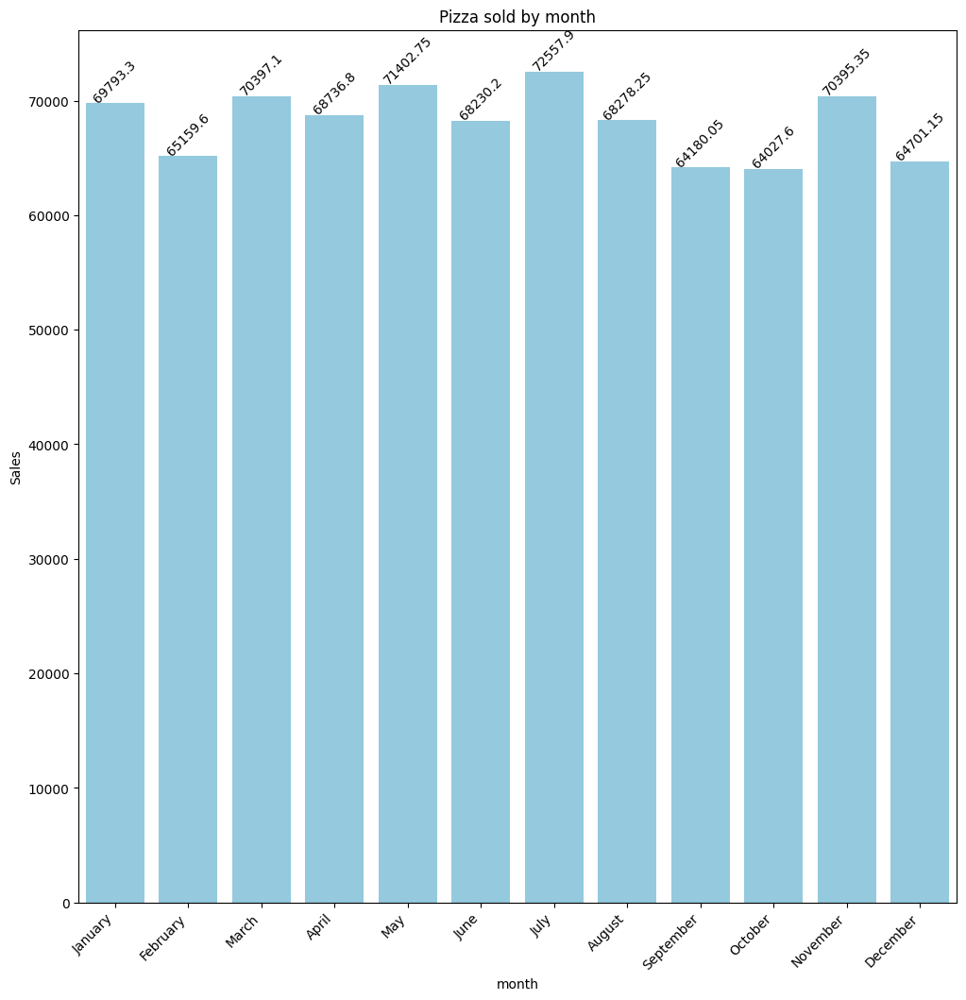
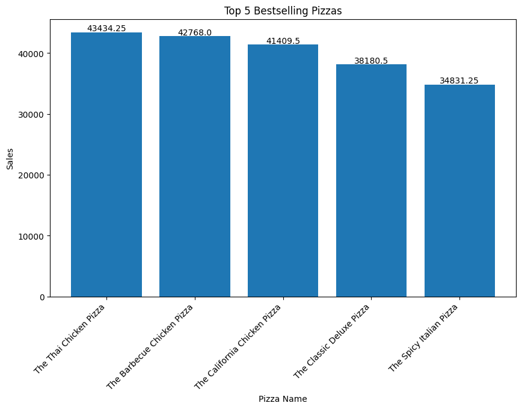
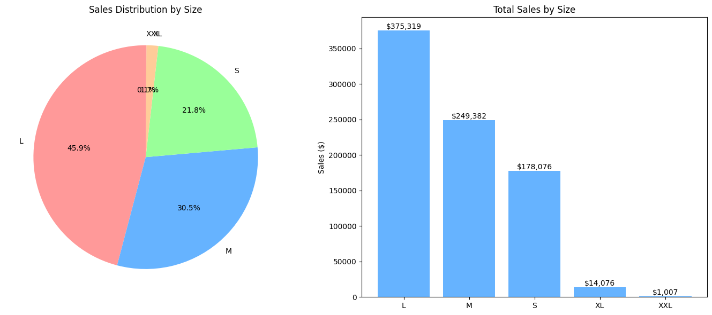

# Pizza Place Sales Analysis

This repository contains a Python-based analysis of sales data from a pizza place. The project explores sales trends, popular pizza types, time-based patterns, and other insights that could help pizza restaurant owners optimize their business.

## 📌 Table of Contents
- [Project Overview](#project-overview)
- [Dataset](#dataset)
- [Technologies Used](#technologies-used)
- [Key Findings](#key-findings)
- [Visualizations](#visualizations)

## � Project Overview
This analysis aims to uncover business insights from pizza sales data, including:
- Sales performance by pizza category/size
- Time-based sales trends (hourly, daily, monthly)
- Revenue analysis
- Popularity metrics for different pizza types

## � Dataset
The dataset contains one year of sales data from a fictitious pizza place, including:
- Orders (order id, date and time)
- Order Details (order details id,order id,pizza id,quantity)
- Pizza (pizza id,pizza type id,size,price)
- Pizza types (pizza type id,name,category,ingredients)

## � Technologies Used
- Python 3.1
- Pandas (data manipulation)
- Matplotlib/Seaborn (visualizations)

## 🔍 Key Findings
The data revealed these insights:
1. The total sales for The Pizza Place is $ 817,860.05
2. The Pizza Place sold 49,574 pizzas from 48,620 orders
3. Most popular pizza size: [Large] accounted for 45.9% of total sales
4. Peak sales hours: Between 12 PM and 2 PM and between 4 PM and 7 PM
5. Highest revenue day: Fridays generated Z% more revenue than average

## 📊 Visualizations

### Sales by Month
  
*Figure 1: Monthly sales trends showing peak month.*

### Top 5 Pizza Categories
  
*Figure 2: Sales distribution across pizza categories.*

### Sales by Pizza Size
  
*Figure 3: Sales distribution across pizza size.*

